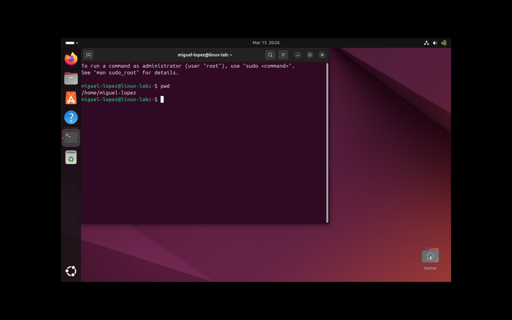

# Lab 1 – Linux System Navigation

## Objective
Practice navigating the Linux file system and inspecting important directories used in system administration.

## Environment
Ubuntu running inside VirtualBox.

## Commands Practiced

pwd
Displays the current working directory.
Screenshot:

ls
Lists files and directories.

ls -la
Lists files including hidden files and permissions.

cd /
Moves to the root directory.

cd /etc
Navigates to the system configuration directory.

cd /var
Navigates to variable system data such as logs.

cd ~
Returns to the user's home directory.

## Key Directories Explored

/etc  
Contains system configuration files.

/home  
Contains user home directories.

/var  
Stores logs, application data, and temporary files.

## What I Learned

Understanding the Linux filesystem hierarchy is essential for troubleshooting servers, locating configuration files, and inspecting system logs.
