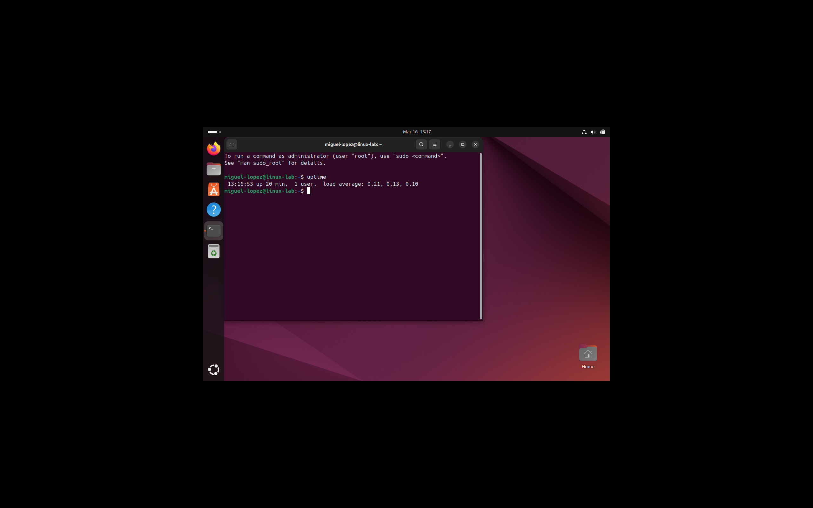
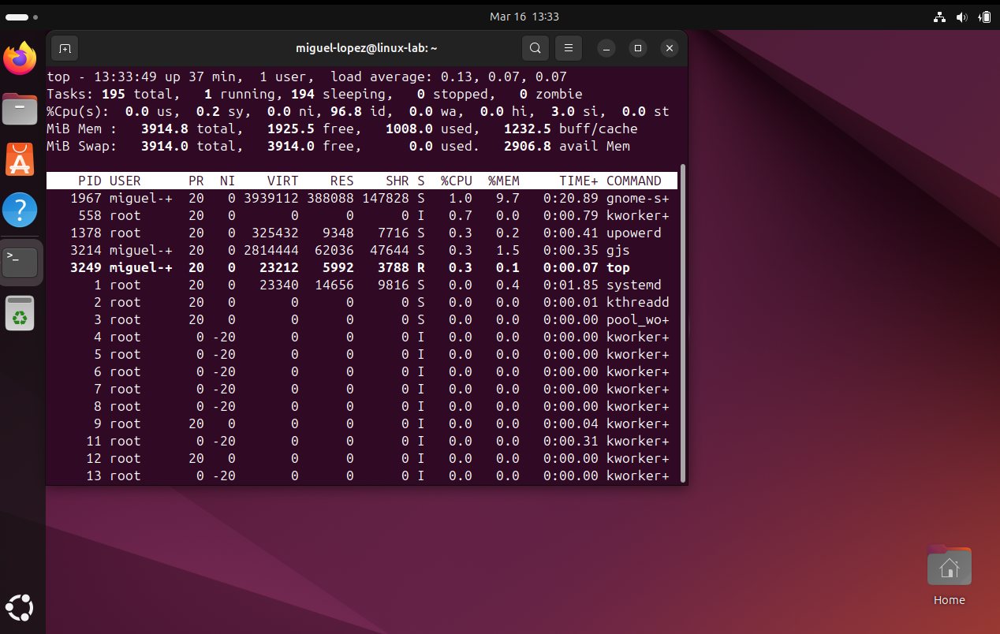
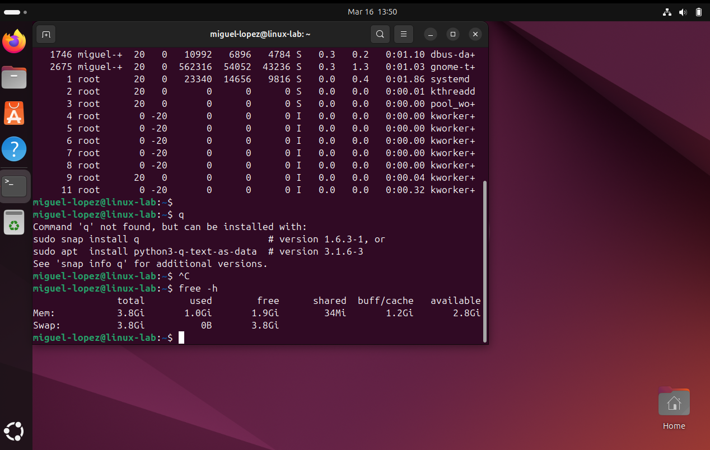
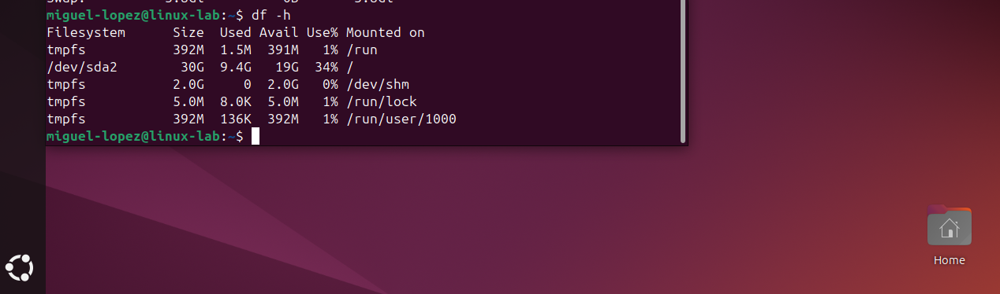
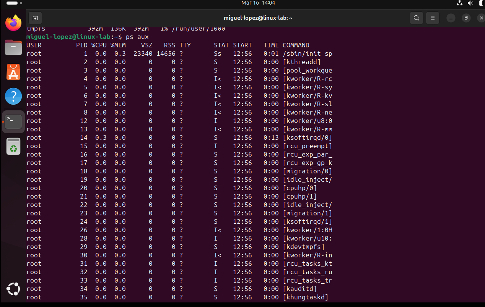

# Lab 2 – System Monitoring

## Objective

Learn how to monitor Linux system health including CPU usage, memory usage, running processes, and disk space.

System monitoring is one of the first steps engineers perform when diagnosing performance issues or investigating incidents.

---

# Check System Uptime

## Command

uptime

## Explanation

The `uptime` command displays how long the system has been running, how many users are logged in, and the system load averages.

## What This Information Means

- **System Time** – Current system clock  
- **Up Time** – How long the system has been running since the last reboot  
- **Users** – Number of logged in users  
- **Load Average** – System workload over 1, 5, and 15 minutes

## Real World Use Case

Operations engineers check `uptime` to determine:

- Whether a system recently rebooted
- If the system load is unusually high
- If an incident might be related to CPU overload

Example scenario:

A server becomes slow.  
An engineer runs:

uptime

If the load average is extremely high, it indicates heavy CPU demand.

## Screenshot

---

# Monitor System Processes in Real Time

## Command

top

## Explanation

The `top` command provides a real-time view of running processes and system resource usage.

It displays:

- CPU usage
- Memory usage
- Running processes
- System load

Press **q** to exit the interface.

## Real World Use Case

Engineers use `top` when a server becomes slow or unresponsive.

Example scenario:

A production system is experiencing performance issues.

An engineer runs:

top

They observe that one process is using 95% of CPU resources.

This helps identify the root cause of the performance problem.

## Screenshot

# Check Memory Usage

## Command

free -h

## Explanation

The `free` command displays system memory usage.

The `-h` flag displays the output in **human readable format** such as MB or GB.

Example output includes:

- Total memory
- Used memory
- Free memory
- Available memory

## Real World Use Case

Engineers use `free -h` when diagnosing memory related performance problems.

Example scenario:

A server application crashes unexpectedly.

Running:

free -h

reveals that available memory is extremely low.

This indicates the system may be running out of RAM.

## Screenshot

---

# Check Disk Usage

## Command

df -h

## Explanation

The `df` command reports disk space usage for all mounted filesystems.

The `-h` option displays sizes in human readable format.

Important columns include:

Filesystem  
Size  
Used  
Available  
Use%

## Real World Use Case

Operations engineers use `df -h` to determine if a server is running out of disk space.

Example scenario:

An application stops writing logs.

Running:

df -h

shows that disk usage is at **100%**, meaning the disk is full.

This prevents new files from being created.

## Screenshot

# View Running Processes

## Command

ps aux

## Explanation

The `ps aux` command lists all currently running processes on the system.

Important columns include:

USER – process owner  
PID – process ID  
%CPU – CPU usage  
%MEM – memory usage  
COMMAND – program being executed

## Real World Use Case

Engineers use `ps aux` when investigating system processes.

Example scenario:

A server is consuming excessive CPU resources.

Running:

ps aux

allows the engineer to identify which process is responsible.

The process can then be analyzed or terminated if necessary.

## Screenshot

