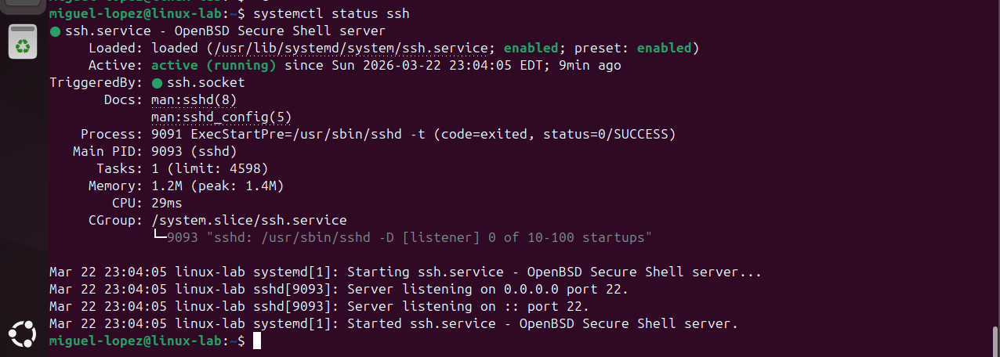
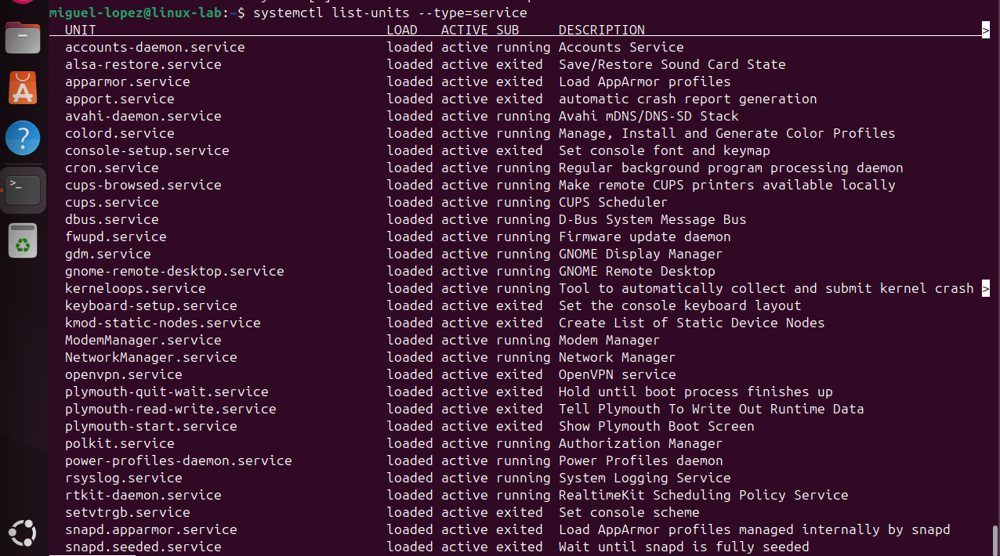

# Lab 3 – Service Management

## Objective

Learn how to inspect, manage, and troubleshoot system services using `systemctl`.

Linux services are background processes that run continuously to provide system functionality. Examples include SSH, web servers, and scheduled tasks.

Managing services is a core responsibility for Linux administrators and service operations engineers.

---

# Check Service Status

## Command

systemctl status ssh

## Explanation

The `systemctl status` command displays detailed information about a service including:

- Whether the service is running
- When the service started
- Service logs
- Process ID

Example output may include:

Active: active (running)

## Real World Use Case

Operations engineers use this command when troubleshooting connectivity issues.

Example scenario:

A user cannot connect to a server via SSH.

An engineer checks the service:

systemctl status ssh

If the service shows **inactive or failed**, it means SSH is not running.

The engineer can then restart the service.

## Screenshot

---

# List Active Services

## Command

systemctl list-units --type=service

## Explanation

This command lists all active services currently running on the system.

It provides information about:

- Loaded services
- Active services
- Service descriptions

Example output may include:

ssh.service  
cron.service  
systemd-logind.service

## Real World Use Case

Engineers use this command to quickly see what services are running on a system.

Example scenario:

A production server is behaving unexpectedly.

An engineer checks the list of active services to verify required services are running.

## Screenshot

---

# Restart a Service

## Command

sudo systemctl restart ssh

## Explanation

The restart command stops and starts a service again.

This is commonly used after:

- Configuration changes
- Service crashes
- System updates

## Real World Use Case

Example scenario:

An engineer modifies an SSH configuration file.

To apply the changes, the SSH service must be restarted.

Command used:

sudo systemctl restart ssh

The service reloads with the updated configuration.

## Screenshot

---

# Check If Service Starts at Boot

## Command

systemctl is-enabled ssh

## Explanation

This command checks whether a service is configured to start automatically when the system boots.

Possible outputs include:

enabled  
disabled

## Real World Use Case

Example scenario:

After rebooting a server, SSH is unavailable.

An engineer checks:

systemctl is-enabled ssh

If the service is **disabled**, it will not start automatically.

The engineer can enable it.

## Screenshot

---

# Skills Demonstrated

Service inspection  
Service troubleshooting  
Service restart procedures  
Understanding Linux system services

These skills are commonly used in Linux administration and service operations roles.
