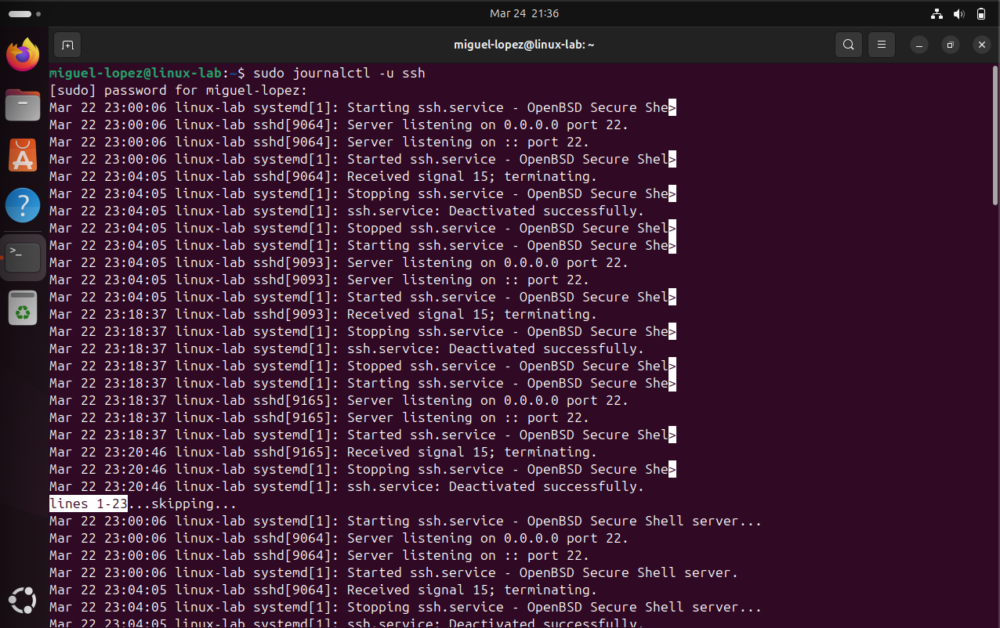
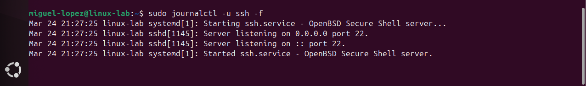
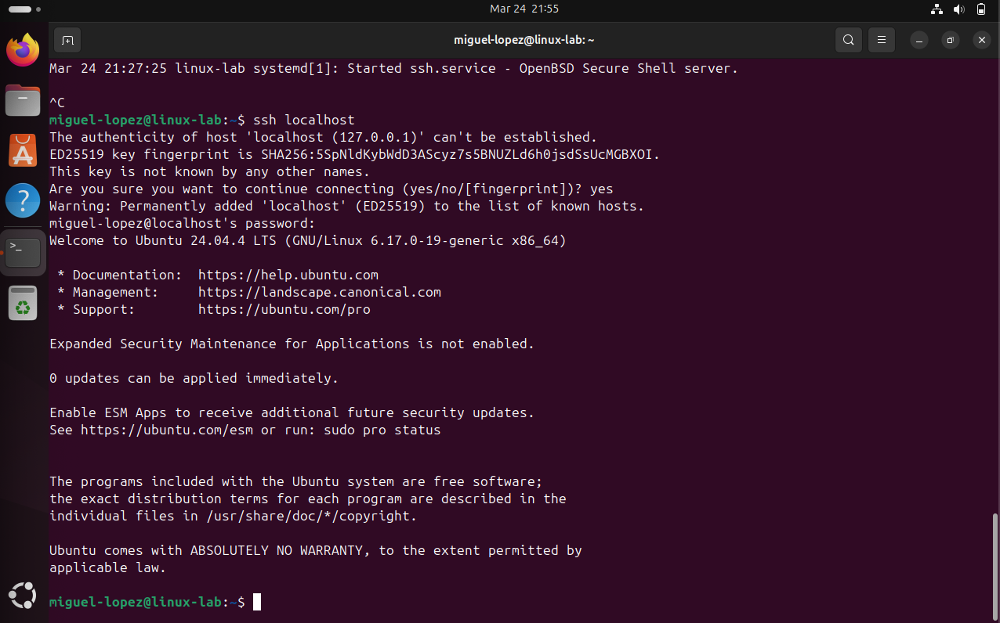

# Lab 4 – Log Analysis

## Objective

Learn how to analyze Linux system logs to monitor activity, troubleshoot issues, and detect potential security events such as failed login attempts.

Log analysis is a critical skill for Linux administrators, cloud engineers, and SOC analysts when investigating incidents and maintaining system security.

---

## View SSH Service Logs

### Command

sudo journalctl -u ssh

### Explanation

The `journalctl` command is used to query logs stored by the systemd journal.

The `-u ssh` option filters logs specifically for the SSH service.

This allows you to view all SSH-related events including service activity and authentication attempts.

### Real World Use Case

Engineers use SSH logs to monitor system access.

Example scenario:

A server is suspected of unauthorized access.

An engineer runs:

sudo journalctl -u ssh

They review logs to identify unknown users or suspicious login attempts.

### Screenshot

---

## Monitor Logs in Real Time

### Command

sudo journalctl -u ssh -f

### Explanation

The `-f` flag allows real-time monitoring of logs as events occur.

This works similarly to `tail -f`.

### Real World Use Case

Engineers use real-time monitoring during troubleshooting or active investigations.

Example scenario:

An engineer monitors logs while testing SSH access.

They can instantly see login attempts and authentication results.

### Screenshot

---

## Generate SSH Login Activity

### Command

ssh localhost

### Explanation

This command initiates an SSH connection to the local system.

It generates log entries that can be analyzed.

### Real World Use Case

Engineers generate activity to verify logging behavior.

Example scenario:

An engineer logs into the system and confirms the login appears in the logs.

### Screenshot

---

## Simulate Failed Login Attempts

### Command

ssh wronguser@localhost

### Explanation

This command attempts to log in using invalid credentials.

It generates failed authentication logs.

### Real World Use Case

Security teams monitor failed login attempts to detect suspicious activity.

Example scenario:

Multiple failed attempts appear in logs, indicating a possible attack.

### Screenshot

---

## Filter Logs for Failed Attempts

### Command

sudo journalctl -u ssh | grep "Failed"

### Explanation

The `grep` command filters output to show only lines containing specific keywords.

This helps isolate failed login attempts.

### Real World Use Case

Engineers use filtering to quickly identify security issues in large log files.

### Screenshot

---

## Analyze Authentication Logs

### Command

sudo cat /var/log/auth.log | grep ssh

### Explanation

The `/var/log/auth.log` file contains authentication-related logs.

Using `grep ssh` filters only SSH-related entries.

### Real World Use Case

SOC analysts use this log to investigate login activity and detect breaches.

### Screenshot

---

## Skills Demonstrated

- Log analysis using journalctl  
- Real-time monitoring  
- Filtering logs with grep  
- Authentication log investigation  
- Security awareness  

---

## Key Takeaways

- Logs provide visibility into system activity  
- SSH logs are critical for monitoring access  
- Failed login attempts may indicate attacks  
- Filtering logs improves efficiency  
