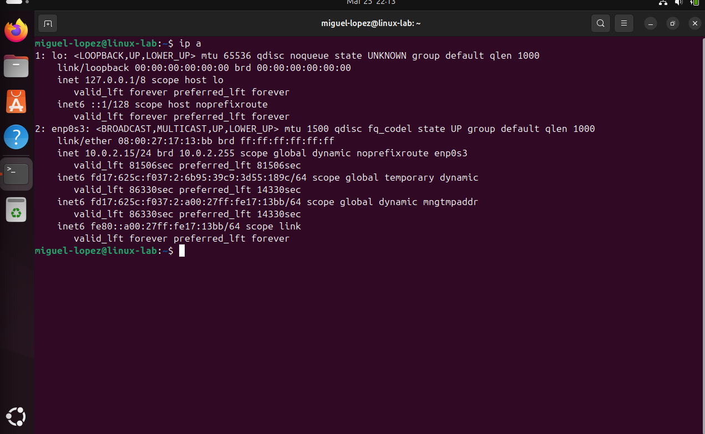
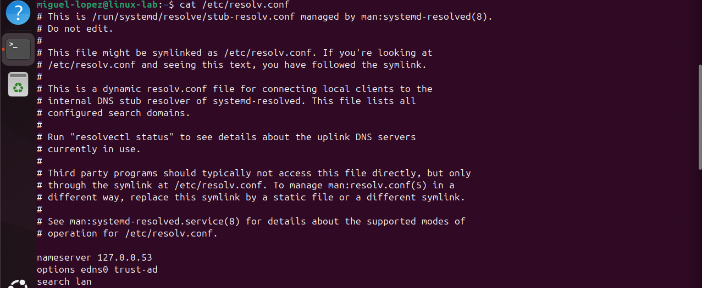
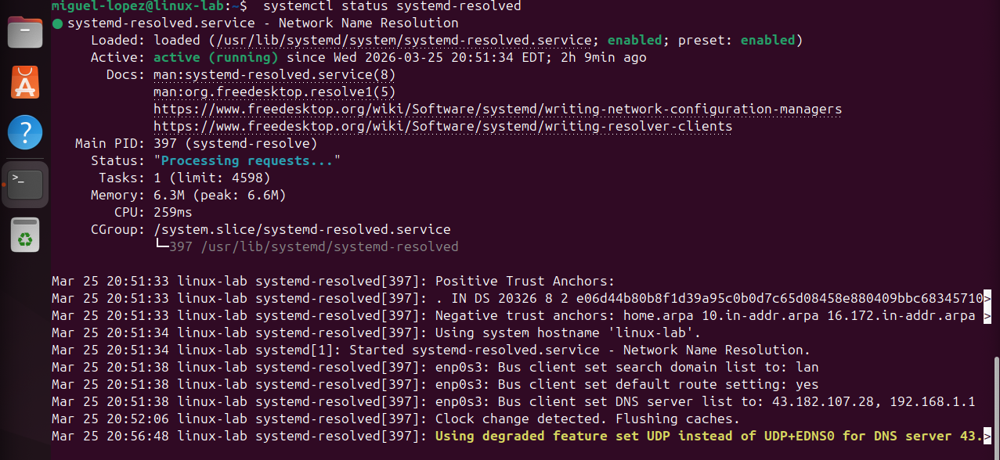

# Lab 5 – Network Troubleshooting

## Objective

Learn how to troubleshoot Linux network connectivity using essential commands to test communication, verify interface settings, inspect routing, and identify DNS-related issues.

Network troubleshooting is a critical skill for Linux administrators, cloud engineers, and SOC analysts when diagnosing connectivity problems, service interruptions, and communication failures between systems.

---

## Check IP Address Information

### Command

ip a

### Explanation

The `ip a` command displays detailed information about network interfaces on the system.

This includes IP addresses, interface status, loopback information, and assigned network settings.

It helps verify whether the system has a valid IP address and whether the network interface is up.

### Real World Use Case

Engineers use this command as one of the first steps in troubleshooting connectivity issues.

Example scenario:

A server cannot communicate with other systems on the network.

An engineer runs:

ip a

They confirm whether the correct interface is active and whether the machine has a valid IP address assigned.

### Screenshot

---

## Test Network Connectivity with Ping

### Command

ping -c 4 8.8.8.8

### Explanation

The `ping` command tests connectivity between the system and a remote host.

The `-c 4` option limits the test to 4 packets.

Using `8.8.8.8` helps test basic internet connectivity without relying on DNS resolution.

### Real World Use Case

Engineers use ping to determine whether a system can reach another device across the network.

Example scenario:

A user reports that a server cannot access the internet.

An engineer runs:

ping -c 4 8.8.8.8

If replies are received, the network path is working and the issue may be related to DNS instead.

### Screenshot

---

## Test DNS Resolution

### Command

ping -c 4 google.com

### Explanation

This command tests both connectivity and DNS name resolution.

If the hostname resolves and replies are received, it confirms the system can translate domain names into IP addresses.

If this fails while pinging an IP address works, the problem is likely DNS-related.

### Real World Use Case

Engineers use this to separate general connectivity issues from DNS failures.

Example scenario:

A system can reach external IP addresses but cannot access websites by name.

An engineer runs:

ping -c 4 google.com

This helps confirm whether DNS resolution is functioning properly.

### Screenshot

---

## View Routing Table

### Command

ip route

### Explanation

The `ip route` command displays the system routing table.

It shows how traffic is directed, including the default gateway and routes for local networks.

This is useful when checking whether traffic has a valid path to leave the system.

### Real World Use Case

Engineers use routing information when troubleshooting why traffic cannot reach external networks.

Example scenario:

A machine has an IP address but still cannot reach other networks.

An engineer runs:

ip route

They verify that a valid default gateway exists and that routes are correctly configured.

### Screenshot

---

## Check DNS Configuration

### Command

cat /etc/resolv.conf

### Explanation

The /etc/resolv.conf file contains DNS configuration.

On modern Linux systems, this file may point to a local DNS resolver (127.0.0.53) managed by systemd-resolved instead of listing actual DNS servers.

This means DNS queries are first handled locally and then forwarded to upstream DNS servers.

To view the real DNS servers in use, engineers can run

resolvectl status

### Real World Use Case

Engineers troubleshoot DNS issues by verifying both:

The local resolver configuration (/etc/resolv.conf)
The upstream DNS servers (resolvectl status)

Example scenario:

A system cannot resolve domain names.

An engineer checks: cat /etc/resolv.conf

If it shows 127.0.0.53, they then run: resolvectl status

to confirm the actual DNS servers and ensure they are valid.

### Screenshot

---

## Check Listening Ports

### Command

ss -tulnp

### Explanation

The `ss -tulnp` command displays active listening ports and the services associated with them.

This helps verify whether a service is actually listening for network connections.

It is useful when diagnosing why a remote connection to a server is failing.

### Real World Use Case

Engineers use this command when a service appears down or unreachable from another machine.

Example scenario:

A web server is reported as inaccessible.

An engineer runs:

ss -tulnp

They confirm whether the service is listening on the expected port such as 80 or 443.

### Screenshot

---

## Trace Network Path to a Host

### Command

traceroute 8.8.8.8

### Explanation

The `traceroute` command shows the path packets take to reach a remote host.

It helps identify where connectivity issues may be occurring between the local system and the destination.

If the command is not installed, it may need to be installed first depending on the Linux distribution.

### Real World Use Case

Engineers use traceroute when troubleshooting slow or failed connections across multiple network hops.

Example scenario:

A server can reach some destinations but fails to reach others.

An engineer runs:

traceroute 8.8.8.8

They review where the path stops or where latency increases significantly.

### Screenshot

---

## Skills Demonstrated

- IP address verification using `ip a`  
- Connectivity testing with `ping`  
- DNS troubleshooting  
- Route inspection using `ip route`  
- DNS server validation with `resolv.conf`  
- Port and service verification using `ss`  
- Path analysis with `traceroute`  

---

## Key Takeaways

- Network troubleshooting should begin with interface and IP verification  
- Pinging an IP address helps confirm basic connectivity  
- Pinging a hostname helps identify DNS-related issues  
- Routing tables determine how traffic leaves the system  
- DNS configuration is essential for hostname resolution  
- Listening ports confirm whether services are available on the network  
- Traceroute helps locate where network communication is failing  
